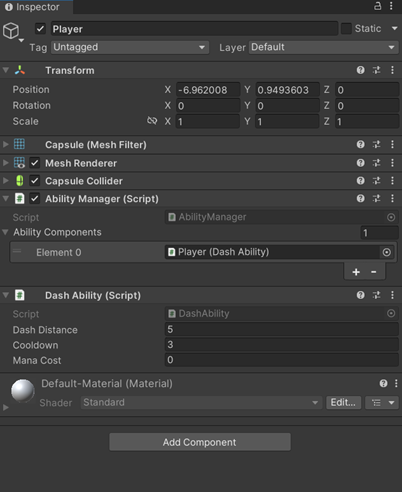
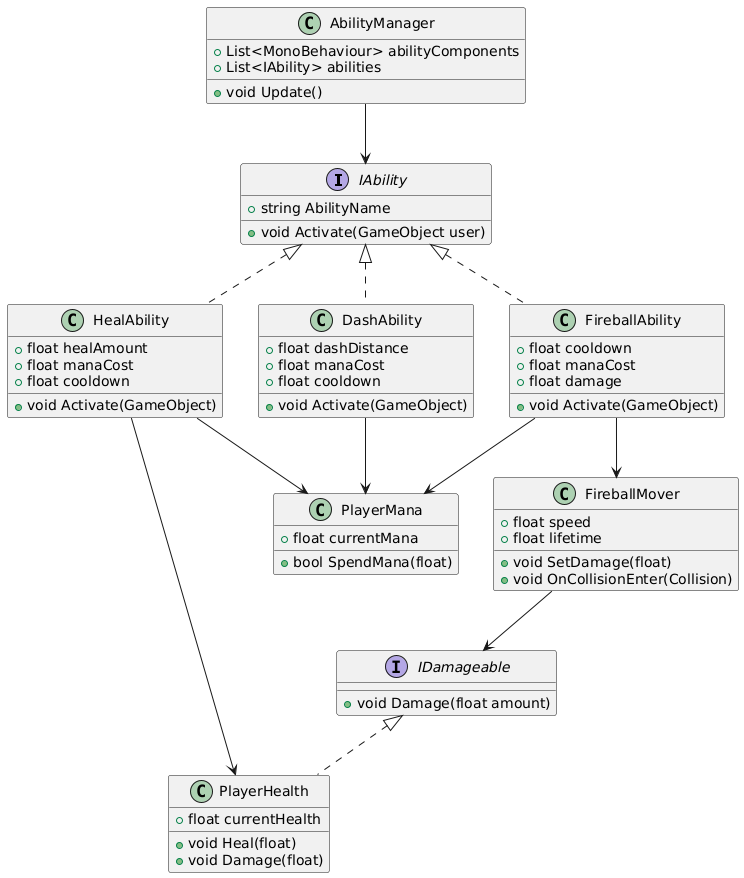

# 🎯 Modular Ability System – Unity Asset

## 📦 Overview

The **Modular Ability System** is a flexible and extensible Unity package for adding reusable character abilities like **Dash**, **Heal**, and **Fireball**, with support for **cooldowns**, **mana cost**, and **damage handling**. Ideal for RPGs, action games, and any game needing scalable skill systems.

---

---

## Demo

## 

## 📁 Folder Structure

```
ModularAbilitySystem/
│
├── Documentation/
│   └── README.md (this file)
│
├── Prefabs/
│   └── Fireball.prefab
│
├── Scenes/
│   └── DemoScene.unity
│
├── Scripts/
│   ├── Abilities/
│   │   ├── DashAbility.cs
│   │   ├── HealAbility.cs
│   │   └── FireballAbility.cs
│   │
│   ├── Components/
│   │   ├── PlayerHealth.cs
│   │   ├── PlayerMana.cs
│   │   └── FireballMover.cs
│   │
│   ├── Core/
│   │   └── AbilityManager.cs
│   │
│   └── Interfaces/
│       ├── IAbility.cs
│       └── IDamageable.cs
```

---

## 🚀 Features

- 🔌 **Plug-and-Play Abilities** – Drag-and-drop architecture using interfaces and Unity components
- ⏱️ **Cooldown & Mana Cost** per ability
- 🔥 **Projectile Logic (Fireball)** with runtime damage injection
- 💙 **Health and Mana Management** components included
- 🖱️ **Mouse Input Support** – Fire abilities using left-click via `AbilityManager`
- 🎮 **Flexible Input Support** – Use keyboard, mouse, AI, or UI to activate abilities
- 📜 Fully documented and easy to extend

---

## 🎮 Setup Instructions

1. Open the `DemoScene.unity` in the `Scenes/` folder.
2. Select the `Player` GameObject.
3. The following scripts are already attached:
   - `AbilityManager`
   - `DashAbility`, `HealAbility`, `FireballAbility`
   - `PlayerHealth`, `PlayerMana`
4. In the Inspector:
   - Add abilities to the `AbilityManager → Ability Components` list
   - Assign the `Fireball.prefab` to `FireballAbility → fireballPrefab`

## To Setup in a new Scene

1.  Create a new capsule with any name example `player` and attach the `ability manager` from the `./core`
2.  while the `player` game object is selected attache the abilities ex `DashAbility` to the gameobject also drag it from the gameobject and attach it to the `abilitymanager`
3.  The first ability is activated with keyboard press `q` and second in `e` and the third with `mouseclick`.

### 🧩 Setup Inspector Diagram



---

## 🎯 Usage Guide

### Keyboard & Mouse Input:

| Key        | Ability                         |
| ---------- | ------------------------------- |
| Q          | Dash                            |
| E          | Heal                            |
| Left Click | Fireball (via `AbilityManager`) |

---

## 🧱 Classes and Interfaces

### 🔹 Interfaces

- **`IAbility`** – Base interface for all abilities

  - `void Activate(UnityEngine.GameObject user)`
  - `string AbilityName { get; }`

- **`IDamageable`** – Interface used for any object that needs to recieve damage.
  - `void Damage(float amount)`

### 🔹 Core

- **`AbilityManager`** – Manages and activates assigned abilities, including keyboard and mouse input

### 🔹 Abilities

- **`DashAbility`** – Moves player forward with cooldown
- **`HealAbility`** – Heals character's health
- **`FireballAbility`** – Spawns a projectile with runtime-configurable damage

### 🔹 Components

- **`PlayerHealth`** – Tracks current and max health.
- **`PlayerMana`** – Tracks current and max Mana.
- **`FireballMover`** – Controls projectile movement, damage, and impact

---

### 🧩 UML Class Diagram – System Architecture Overview



## 🔄 How to Add New/Custom Abilities

1. Add your new ability script to the `Abilities` folder under the same namespace `ModularAbilitySystems`.

2. Update the logic in `AbilityManager` if you want to assign a custom input/controller to trigger the new ability.

3. Once your ability script is ready, attach it to the player GameObject and add it to the `abilityComponents` list in the Inspector by dragging it in.

```csharp
namespace ModularAbilitySystems

{
    public class MyNewAbility : MonoBehaviour, IAbility

    {
        public string AbilityName => "Your Ability Name Here";

        public void Activate(GameObject user)

        {
            // Custom ability logic
        }
    }
}

```

---

## 🎮 Custom Input / Controllers

The `AbilityManager` is input-agnostic — you can trigger any ability from UI buttons, AI, or other scripts.

Here’s a sample `Update()` method that handles ability activation via keyboard and mouse:

```csharp
void Update()
{
    if (Input.GetKeyDown(KeyCode.Q) && abilities.Count > 0)
        abilities[0].Activate(gameObject);

    if (Input.GetKeyDown(KeyCode.E) && abilities.Count > 1)
        abilities[1].Activate(gameObject);

    if (Input.GetMouseButtonDown(0) && abilities.Count > 2)
        abilities[2].Activate(gameObject);
}

```

### 🔧 Requirements

- Unity 2021.3 or newer
- Rigidbody required for projectile prefabs

---

### 📋 Limitations

- Not multiplayer-ready out of the box
- No built-in UI (cooldowns, health bars, etc.)
- Requires manual setup via Inspector

---

### 🔐 License

MIT License

---

### 🧾 Changelog

### v1.0.0

- Initial release
- Dash, Heal, and Fireball abilities
- Mana and cooldown logic
- Fireball collision and damage
- Basic input and demo scene

---

## 📧 Support

For bug reports, feature requests, or help using the package, contact [t.m.ananthakrishnan@gmail.com] or visit the asset page.

```

```
